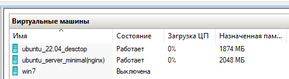
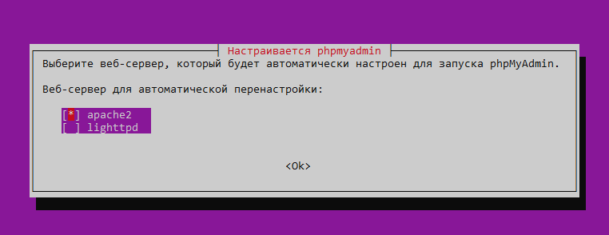
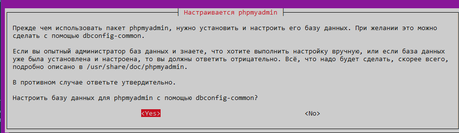

<a id="ubuntu"></a>
## Web-сервер на Ubuntu server 22.04  GIT
>Ubuntu Server LTS, как можно понять из названия, это серверная операционная система на базе ядра Linux.


Данная операционная система была выбрана для реализации дипломного проекта, потому, что:

1. Это один из самых безопасных и стабильных свободно-распространяемых дистрибутивах Linux.
2. Простота первичной настройки, много качественной документации.
3. Нетребовательность к аппаратным ресурсам.
4. Простота переноса конфигурации на другой сервер.

---

Данная операционная система была установлена на Windows 10 Hyper-V


1. Для виртуальной машины был задан статический IP адрес: 192.168.0.250
2. На физической машине, было прописано доменное имя для виртуальной машины: 192.168.0.250      test.ru
3. Для back-end был выбран веб-сервер Apache
4. Для front-end был выбран Nginx
---

На виртуальной машине было установлено следующее программное обеспечение:

1. [NGINX](#nginx)
2. [APACHE](#apache)
3. [SSH-server](#ssh-server)
4. [VSFTP](#vsftp)
5. [PHP 8.1](#php8)
6. [MySQL](#mysql)
7. [PHPMyAdmin](#phpmyadmin)

<a id="nginx"></a>
Nginx — веб-сервер и почтовый прокси-сервер, работающий на Unix-подобных операционных системах

Откроем порты в брандмауэре UFW:
```
sudo ufw allow 80/tcp
sudo ufw allow 8080/tcp
```
Установка Nginx:
```
sudo apt update
sudo apt install nginx
```
После установки тестируем конфигурацию:
```
sudo nginx -t
```
Конфигурация nginx:
```
server {
        listen 80 default_server;
        listen [::]:80 default_server;

        root /home/www/html;

        # Add index.php to the list if you are using PHP
        index index.html index.htm index.nginx-debian.html;

        server_name test.ru www.test.ru;

    # Динамические запросы
    location / {
        proxy_pass http://localhost:8080;
        proxy_set_header Host $host;
        proxy_set_header X-Forwarded-For $proxy_add_x_forwarded_for;
        proxy_set_header X-Real-IP $remote_addr;
        }

  # Статические запросы 
    location ~* ^.+.(jpg|jpeg|gif|png|ico|css|zip|pdf|txt|tar|js)$ {
        root /var/www/html;
        }
```
---
<a id="apache"></a>
Apache HTTP-сервер — свободный веб-сервер. Apache является кроссплатформенным ПО, поддерживает операционные системы Linux, BSD, macOS, Microsoft Windows, Novell NetWare, BeOS. Основными достоинствами Apache считаются надёжность и гибкость конфигурации

Установка Apache:
```
sudo apt install apache2
```
Откроем 8080 порт:
```
sudo ufw alllow 8080
```
Изменим порт Apache в /etc/apache2/ports.conf:
```
Listen 8080

<IfModule ssl_module>
        Listen 443
</IfModule>

<IfModule mod_gnutls.c>
        Listen 443
</IfModule>

```
```
Listen 8080 
<VirtualHost *:8080> 
    ServerName www.example.com 
    ServerAdmin webmaster@localhost 
    DocumentRoot /var/www/html 
    ErrorLog /var/log/httpd/error.log 
    CustomLog /var/log/httpd/access.log combined 
</VirtualHost>
```


<a id="ssh-server"></a>
OpenSSH — набор программ, предоставляющих шифрование сеансов связи по компьютерным сетям с использованием протокола SSH.

Разрешаем подключение по SSH:
```
sudo ufw allow 22
```

<a id="vsftp"></a>
vsftpd — FTP-сервер с поддержкой IPv6 и SSL. Является FTP-сервером по умолчанию многих операционных систем, и обслуживает официальные репозитории ftp.debian.org, ftp.redhat.com, ftp.openbsd.org, ftp.freebsd.org. До 2017 года использовался на официальном FTP ядра Linux

Установка vsftp:
```
sudo apt install vsftpd
```
Добавляем в автозагрузку:
```
sudo systemctl enable vsftpd
```
Редактируем файл конфигурации:
```
# настраиваем сервера по IPv4:
listen=YES
listen_ipv6=NO

# запрещаем доступ анонимным пользователям:
anonymous_enable=NO

# разрешаем доступ локальным пользователям:
local_enable=YES

# разрешаем пользователям работать с файлами:
write_enable=YES

# назначаем права новым файлам:
local_umask=022

# включаем сообщения для пользователя при входе: 
dirmessage_enable=YES

# разрешаем использовать локальное время на сервере:
use_localtime=YES

# включаем логирование операций:
xferlog_enable=YES

# включаем передачу данных по 20 порту:
connect_from_port_20=YES

# прописываем директорию для хранения логов:
xferlog_file=/var/log/vsftpd.log

# задаём формат логов:
xferlog_std_format=YES

# даём доступ пользователям только к своим домашним каталогам:
chroot_local_user=YES
allow_writeable_chroot=YES

# включаем поддержку авторизации PAM:
pam_service_name=vsftpd

# разрешаем вход только пользователям из файла userlist: 
userlist_enable=YES
userlist_file=/etc/vsftpd.userlist
userlist_deny=NO
```

<a id="php8"></a>
PHP — C-подобный скриптовый язык общего назначения, интенсивно применяемый для разработки веб-приложений. В настоящее время поддерживается подавляющим большинством хостинг-провайдеров и является одним из лидеров среди языков, применяющихся для создания динамических веб-сайтов

Установка php 8.1:
```
 apt install libapache2-mod-php8.1 php8.1
```
<a id="mysql"></a>
MySQL — свободная реляционная система управления базами данных. Разработку и поддержку MySQL осуществляет корпорация Oracle, получившая права на торговую марку вместе с поглощённой Sun Microsystems, которая ранее приобрела шведскую компанию MySQL AB.

Установка MySQL:
```
sudo apt install mysql-server-8.0
sudo apt install mysql-client
```


<a id="phpmyadmin"></a>
phpMyAdmin — веб-приложение с открытым кодом, написанное на языке PHP и представляющее собой веб-интерфейс для администрирования СУБД MySQL. PhpMyAdmin позволяет через браузер и не только осуществлять администрирование сервера MySQL, запускать команды SQL и просматривать содержимое таблиц и баз данных

Установка PHPMyAdmin:
```
sudo apt install php-mysql
```


 

 Далее необходимо задать пароль для доступа к phpmyadmin


