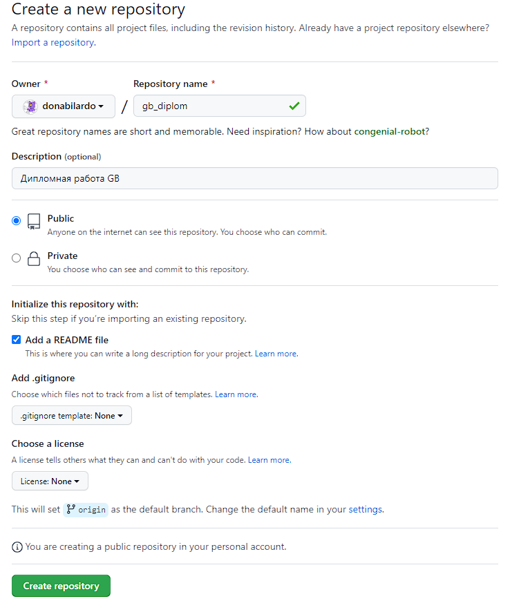

# **Тема проекта**: Создание портала услуг для автолюбителя 
## **Цель**: Реализовать возможность для автовладельцев, приобретение полиса ОСАГО, исправление КБМ, реализовать удобный поиск автосервиса или СТО в своем городе, а так же витрину автотоваров.  

### **Задачи**:   

1. Изучить литературу, касающуюся темы проекта;    

2. Рассмотреть основные виды и методы создания веб-приложений; 

3. Базовая вёрстка проекта

4. Адаптировать вёрстку для различных мобильных устройств;

5. Проектирование базы данных

6. Проектирование логики веб-приложения
---


## **Используемые нструменты и технологии**: 
 
  
###  1. [Редактор кода Visual Studio Code](#vscode)
###  2. [Таск-ранер Gulp](#gulp)
###  3. [Препроцессор SCSS](#scss)
###  4. [Cистема управления версиями GIT](#git)
###  5. [Язык программирования PHP 7.4](#php)
###  6. [Web-сервер на Ubuntu server 22.04](#ubuntu)


<a id="vscode"></a>
## Visual Studio Code
> Редактор исходного кода, разработанный Microsoft для Windows, Linux и macOS. Позиционируется как «лёгкий» редактор кода для кроссплатформенной разработки веб- и облачных приложений.   

[Сайт разработчика](#https://code.visualstudio.com/download) 

<code>      | Версия |
:-------- |:-----| 
VSCode  | 1.76.0  | 
Node.js     | 16.14.2    | 
Windows      | 10.0.19045    | 
</code>

***

<a id="gulp"></a>
## Gulp  4.0.2
>Gulp — это таск-менеджер для автоматического выполнения часто используемых задач, написанный на языке программирования JavaScript. Программное обеспечение использует командную строку для запуска задач, определённых в файле Gulpfile. Создан как ответвление от проекта Grunt, чтоб взять из него лучшие практики.   [Сайт разработчика](#https://gulpjs.com/docs/en/getting-started/quick-start/) 

<code>    Модуль  | Версия | Описание
:-------- |:-----| :-----|
gulp-autoprefixer  | 8.0.0  | Управляет браузерными префиксами в проекте. Задача устанавливать префиксы для тех CSS3-свойств, которые нуждаюся в этом на данный момент 
gulp-cssbeautify     | 3.0.1    | "Форматировщик" CSS файла
gulp-strip-css-comments      | 2.0.0    | Удаление коментариев из таблиц стилей (CSS)
gulp-rename|2.0.0 | Переименование минифицированных файлов проекта
[gulp-sass](#gulp-sass)|5.1.0| Компилятор SASS в CSS
[sass](#gulp-sass)|1.58.3| Компилятор SASS
gulp-cssnano|2.1.3| Минифицирует таблицу стилей (удаление пробелов, переносов строк и тд)
[gulp-rigger](#rigger)|0.5.8| Объеденяет JavaScript файлы в один
gulp-uglify|3.0.2| Мнифицирует JavaScript код
[gulp-plumber](#plumber)|1.2.1| Отлов ошибок при сборке проекта
|[gulp-notify](#plumber)|4.0.0| Вывод ошибок
[gulp-imagemin](#imagemin)|7.1.0| Сжимает и оптимизирует PNG, JPEG, GIF, SVG
del|6.0.0| Очищает каталог с готовым проектом перед новой компиляцией
panini|1.7.2| Переиспользование готового кода 
[browser-sync](#browsersync) |2.28.1| Live Server Reload
||
||

</code>

<a id="npminstall"></a> 

### Установка необходимых модулей Gulp (разрешение возможных конфликтов версий)

```
npm install gulp gulp-autoprefixer gulp-cssbeautify  gulp-strip-css-comments gulp-rename gulp-cssnano gulp-rigger gulp-uglify gulp-plumber gulp-imagemin del panini browser-sync--save-dev
```
Для гарантированной установки нужных версий модулей, необъодимо добавить ключ:
```
--save-dev --save-exact
```
<a id="gulp-sass"></a>
По официальной документации, компилятор SASS необходимо устанавливать отдельно:
```
npm i sass gulp-sass --save-dev
```
<a id="imagemin"></a>
Для корректной работы модуля gulp-imagemin нужно поставить версию 7.1.0
```
npm i gulp-imagemin@7.1.0
```
Параметры сжатия изображений проекта (степнь, сжатия и [тд](#https://www.npmjs.com/package/gulp-imagemin))
```
.pipe(imagemin([
            imagemin.gifsicle({interlaced: true}),
            imagemin.mozjpeg({quality: 75, progressive: true}),
            imagemin.optipng({optimizationLevel: 5}),
            imagemin.svgo({
                plugins: [
                    {removeViewBox: true},
                    {cleanupIDs: false}
                ]
            })
        ]))
```

<a id="rigger"></a>
В главном файле необходимо добавить все подключаемые JS файлы в нужном порядке
```
//= script_1.js
//= script_2.js
//= и так далее. файлы добавляются в том порядке. в котором прописаны
```


<a id="browsersync"></a> 

#### Настройка BrowserSync 
[Документация на сайте разработчика](https://browsersync.io/docs/gulp "Настройка BrowserSync")
```
function serve() {
    browserSync.init({
        server: {
            baseDir: "./" + distPath
        }
        //,
        //port: 3000,
       // notify: false
       //при необходимости изменить порт по умолчанию
    });
}
```


<a id="plumber"></a>
Plumer + gulp-notify = отображение ошибок которые могут возникнуть в процессе вёрстки
```
Установка модуля npm i gulp-notify --save-dev 

Для вывода ошибки, в plumber нужно передать:
{errorHandler: notify.onError("Error: <%= error.message %>")}
```
****


## Система контроля версий  GIT
>Git — распределённая система управления версиями. Проект был создан Линусом Торвальдсом для управления разработкой ядра Linux, первая версия выпущена 7 апреля 2005 года. На сегодняшний день его поддерживает Джунио Хамано.   

[Сайт разработчика терминала](#https://git-scm.com/)

Для выполнения дипломной работы, был создан открытый репозиторий на [GitHub.com](#https://github.com/donabilardo/gb_diplom)



Далее, на локальной машине (где писался дипломный проект) был создан файл README.md (текущий файл) для описания проекта. а так же файл .gitignore

```
echo "# Дипломный проект" >> README.md
```
[Актуальная версия](#https://github.com/donabilardo/gb_diplom/blob/master/README.md)

```
echo " " >> .gitignore
```
[Актуальная версия](#https://github.com/donabilardo/gb_diplom/blob/master/.gitignore)


Следующий шаг - это инициализация репозитория командой:
```
git init
```

После чего, в репозиторий были добавлены созданные на предыдущих этапах файлы, командой:

```
git add .gitignore README.md
```

После чего был создан initial commit
```
git commit -m "first initial commit"
```

Переименование главной ветки:
```
git branch -M master
```
Добавление удаленного репозитория:
```
git remote add origin https://github.com/donabilardo/gb_diplom
```
Отправляем коммит в удаленный репозиторий:
```
git push -u origin master
```
В дальнейшем все изменения проекта можно отследить в удаленном репозитории

----

<a id="ubuntu"></a>
## Web-сервер на Ubuntu server 22.04  GIT
>Ubuntu Server LTS, как можно понять из названия, это серверная операционная система на базе ядра Linux.

Данная операционная система была выбрана для реализации дипломного проекта, потому, что:
1. Она бесплатная
2. Простота первичной настройки
3. Нетребовательность к ресурсам
4. Простота переноса конфигурации на другой сервер

Данная операционная система была установлена на Windows 10 Hyper-V


## **Структура дипломного проекта**: 


 


